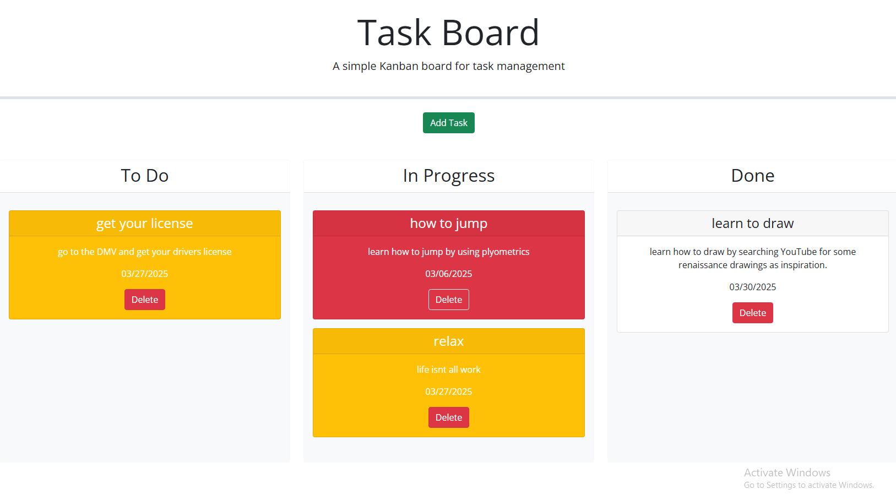

# Task Board

## Table of Contents
- [Description](#description)
- [Installation](#installation)
- [Usage](#usage)
- [Questions](#questions)

## Description
Task Board is really helpful for those that are always under pressure on trying to manage their tasks and knowing which needs to be a priority. by putting it on display those suffering can relax.

## Installation
by downloading the github demo and cloning it into your terminal.

## Usage
Press the add task button, and a modal will pop up, then you will be able to fill out the fields. once you have created your task you are able to move it around to match its status of completion. To add on to that depending on the due date of your task the the task card color will reflect the urgency. if the task is late then it is shown as red. if it is due the same day then it is yellow

## Questions
For any questions, you can reach me at:
- GitHub: [MIKEYP53](https://github.com/MIKEYP53)
- Email: mprz646@gmail.com